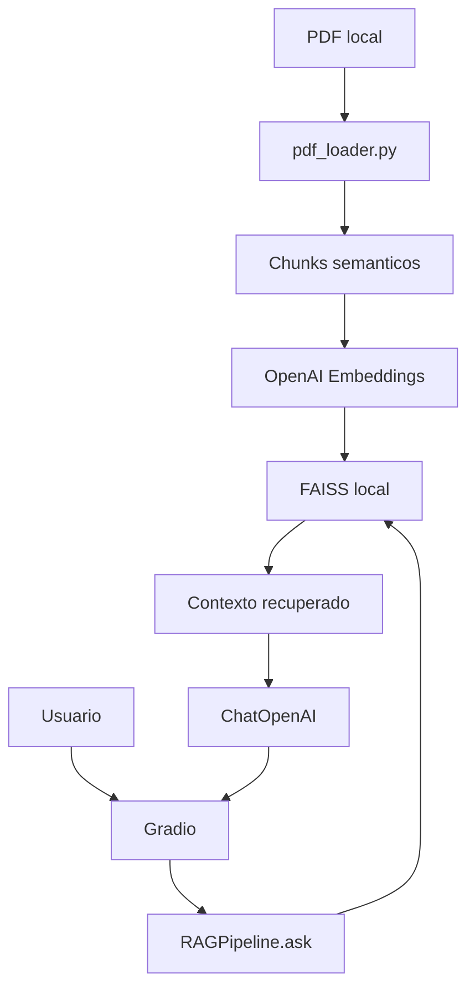

# Arquitetura - Assistente RAG

## Visao Geral

O projeto implementa um Assistente RAG simples para consulta a um unico documento PDF local.

Fluxo principal:

1. `pdf_loader.py` carrega o PDF.
2. O texto e extraido com `pypdf`.
3. O texto e dividido em chunks semanticos por blocos de pergunta e resposta.
4. `OpenAIEmbeddings` gera vetores.
5. FAISS armazena os vetores localmente.
6. O retriever busca os trechos mais relevantes.
7. `ChatOpenAI` gera a resposta com base no contexto recuperado.
8. Gradio exibe pergunta e resposta.

## Componentes

### app/config.py

Centraliza configuracoes do MVP:

- chave OpenAI via `.env`;
- modelo LLM;
- modelo de embeddings;
- caminho do PDF;
- caminho do indice FAISS;
- `TOP_K`;
- tamanho e overlap dos chunks;
- temperatura do LLM.

### app/pdf_loader.py

Responsavel por:

- validar caminho do PDF;
- extrair texto;
- normalizar texto;
- identificar cursores de perguntas numeradas;
- gerar blocos pergunta/resposta;
- gerar chunks semanticos.

Nao contem OpenAI, FAISS ou Gradio.

### app/rag_pipeline.py

Responsavel por:

- criar embeddings;
- criar FAISS local;
- salvar e carregar indice FAISS;
- recuperar contexto;
- montar prompt;
- consultar LLM;
- expor `RAGPipeline.ask(question: str) -> str`.

### app/main.py

Interface Gradio simples:

- um campo para pergunta;
- um campo para resposta;
- integracao com `RAGPipeline`.

## Diagrama

## Decisoes Tecnicas

| Decisao | Justificativa |
|---|---|
| PDF unico local | Mantem escopo controlado |
| Chunking por pergunta/resposta | Preserva contexto semantico do FAQ |
| FAISS local | Simples e adequado ao MVP |
| OpenAI Embeddings | Compatibilidade direta com LangChain |
| Gradio | Interface simples para validacao |
| Sem memoria | Evita complexidade fora do MVP |

## Limites

Nao contempla:

- multiplos documentos;
- upload;
- autenticacao;
- historico de conversa;
- banco relacional;
- deploy em nuvem;
- reranking;
- busca hibrida.
